  

  

---

## Featured Projects

<table>
  <tr>
    <td width="50%" valign="top">
      <h3 align="center">🎨 ai-paint-voice</h3>
      
<a href="https://github.com/wookat/ai-paint-voice"><b>→ GitHub</b></a>

      
语音控制的 AI 绘图应用。多模型智能体 + Scene Graph + 中文语音容错 + 讯飞 ASR/TTS。

      

        
        
      

    </td>
    <td width="50%" valign="top">
      <h3 align="center">📖 ScriptForge</h3>
      
<a href="https://github.com/wookat/ScriptForge"><b>→ GitHub</b></a>

      
Schema 驱动的 AI 小说转结构化剧本工作台。分阶段流水线 + YAML Schema 1.1 + 质量校验。

      

        
        
      

    </td>
  </tr>
  <tr>
    <td width="50%" valign="top">
      <h3 align="center">🥋 taiji-skills</h3>
      
<a href="https://github.com/wookat/taiji-skills"><b>→ GitHub</b></a>

      
Agent-first 模型训练全生命周期管理。9 个 Skills，7+ AI IDE 即插即用。

      

        
        
      

    </td>
    <td width="50%" valign="top">
      <h3 align="center">🧹 DevCleaner</h3>
      
<a href="https://github.com/wookat/DevCleaner"><b>→ GitHub</b></a>

      
Windows 编辑器/IDE 缓存清理工具。Rust + Tauri v2 + React。

      

        
        
      

    </td>
  </tr>
  <tr>
    <td width="50%" valign="top">
      <h3 align="center">🏷️ SeatMark</h3>
      
<a href="https://github.com/wookat/SeatMark"><b>→ GitHub</b></a>

      
考场座位标签生成器。Vue 3 + Tailwind CSS 4，可视化设计器 + 毫米级吸附。

      

        
        
      

    </td>
    <td width="50%" valign="top">
      <h3 align="center">📊 TAAC 2026</h3>
      
<a href="https://github.com/wookat/TAAC"><b>→ GitHub</b></a>

      
2026 腾讯广告算法大赛。PCVRHyFormer 基线优化，特征工程 + 训练策略。

      

        
      

    </td>
  </tr>
</table>

---

---

  
  

