  

---

### approach

把复杂的 AI 技术变成好用的工具。从语音驱动的 AI 绘画到 Schema 驱动的剧本改编，从模型训练自动化到桌面开发工具，每个项目都追求工程化、可验证、可继续打磨。

### selected works

- [**ai-paint-voice**](https://github.com/wookat/ai-paint-voice) — 语音控制的 AI 绘图应用，多模型智能体 + Scene Graph + 中文语音容错
- [**ScriptForge**](https://github.com/wookat/ScriptForge) — Schema 驱动的 AI 小说转结构化剧本工作台，分阶段流水线 + YAML 校验
- [**taiji-skills**](https://github.com/wookat/taiji-skills) — Agent-first 模型训练全生命周期管理，9 个 Skills，7+ AI IDE 即插即用
- [**DevCleaner**](https://github.com/wookat/DevCleaner) — Windows 编辑器/IDE 缓存清理工具，Rust + Tauri v2 + React
- [**SeatMark**](https://github.com/wookat/SeatMark) — 考场座位标签生成器，Vue 3 + Tailwind CSS 4，可视化设计器
- [**TAAC**](https://github.com/wookat/TAAC) — 2026 腾讯广告算法大赛，PCVRHyFormer 基线优化

---

### tech stack

---

  
  

